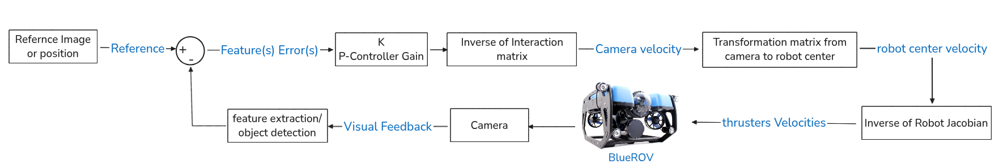
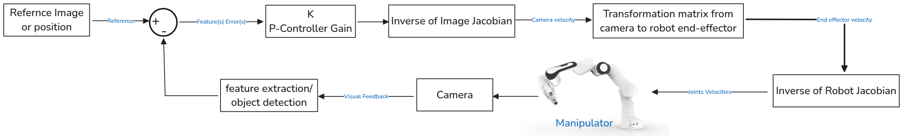
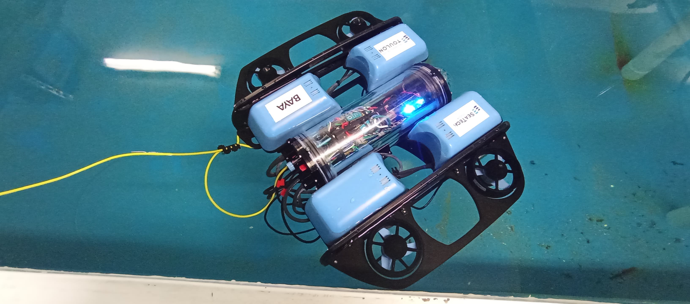
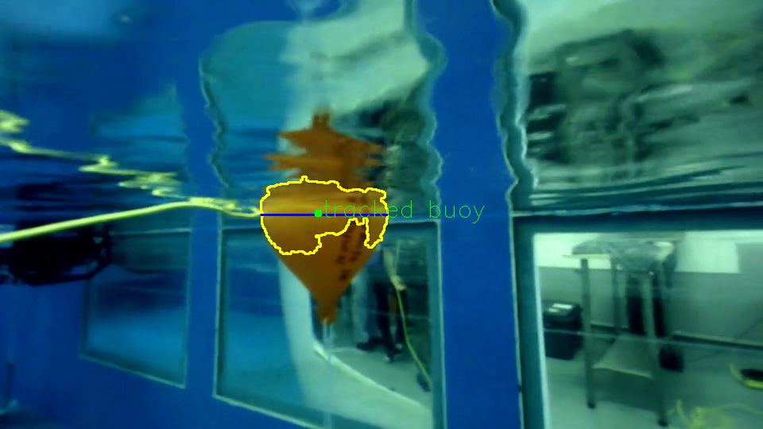
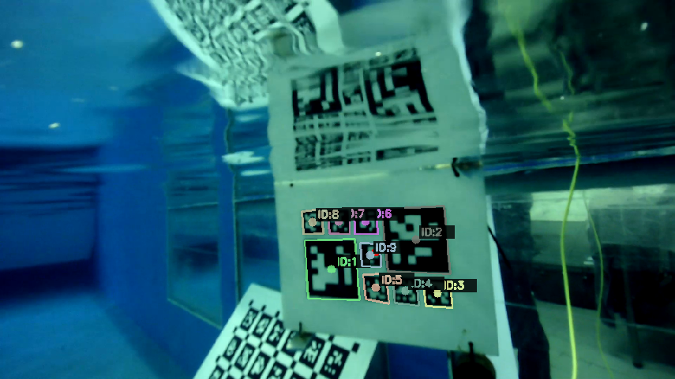
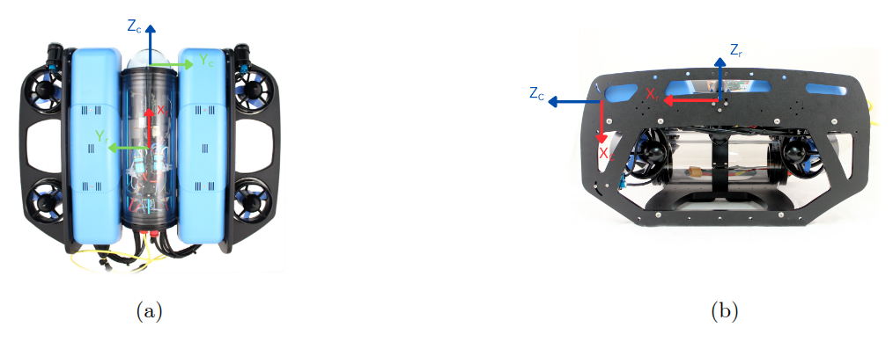
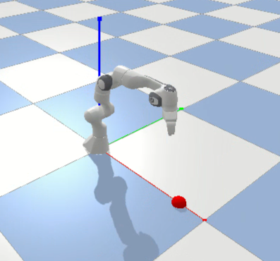
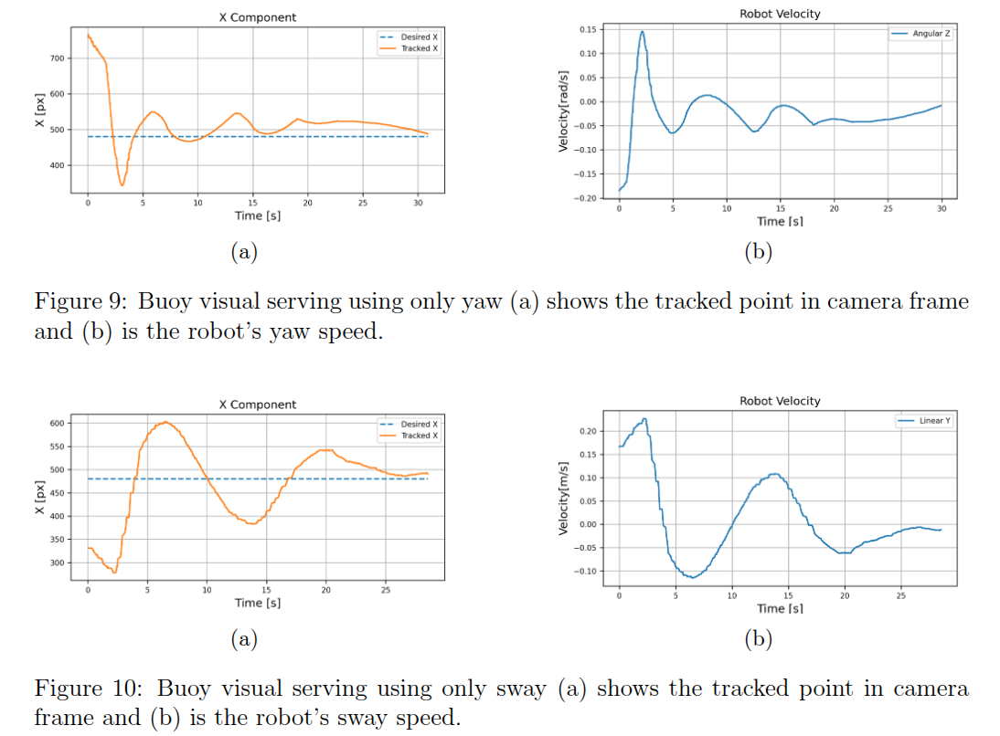
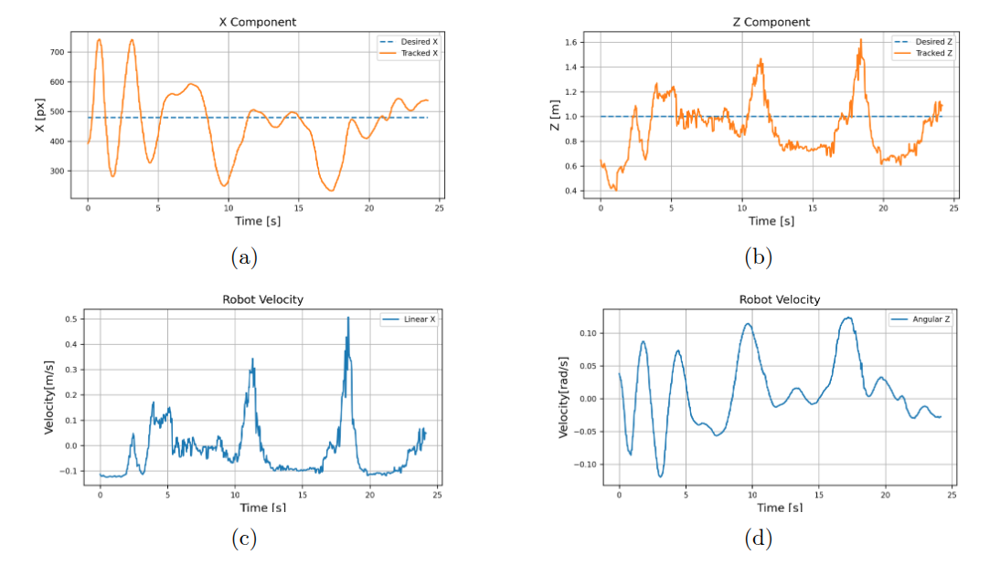
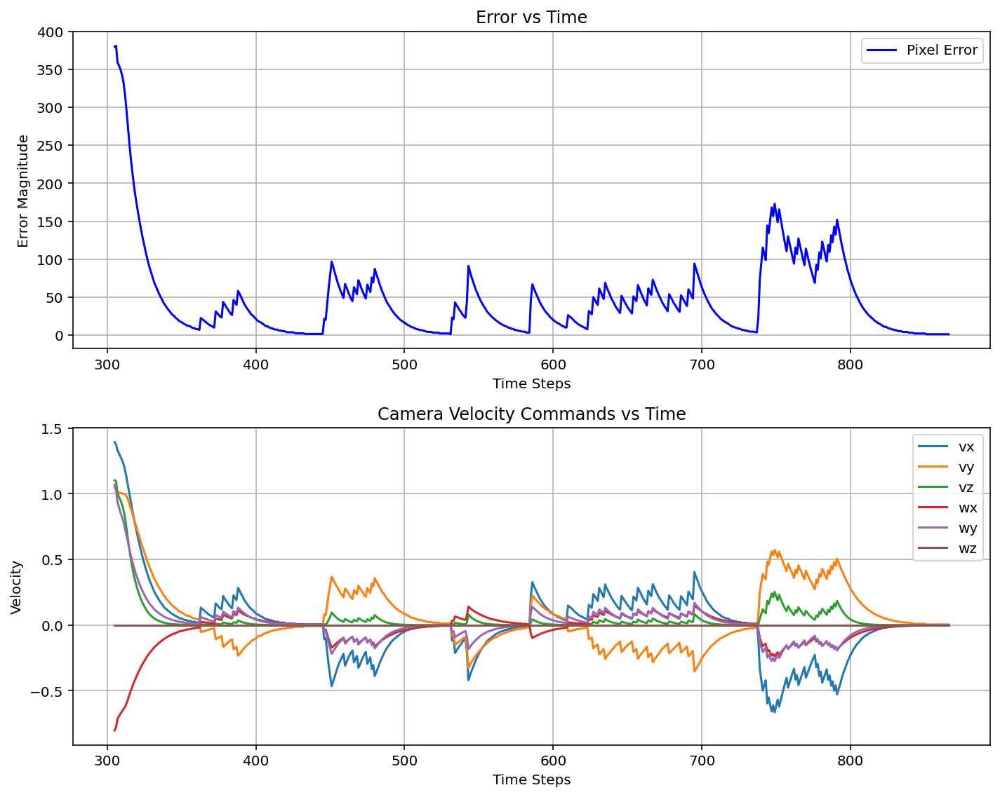

# Implementation of Image-Based Visual Servoing Control

## Overview

IBVS (Image-Based Visual Servoing) is a control strategy used in robotics where the robot’s movements are directly controlled based on the error between the current image (from a camera) and a target image or position. The primary idea is to minimize the difference between the target object's image or position and its actual position in the camera view. This approach allows the robot to perform tasks like object tracking grasping, and different manipulation tasks solely using visual information from the camera.

In this practical work, we implemented visual servoing control to allow a BlueROV to track objects within an underwater environment. The control diagram is illustrated below:

BlueROV IBVS Control Diagram

As shown in the diagram, an IBVS loop is executed in which a desired image feature is compared to the current feature extracted from the camera image, producing an error in image space. That error is scaled by a proportional gain and fed through the inverse of the interaction matrix (the image Jacobian) to compute the six‑degree‑of‑freedom camera‐frame velocity that will drive the feature toward its goal. A transformation then converts that camera twist into an equivalent body‑frame velocity for the BlueROV, and the inverse of the vehicle’s Jacobian allocates those desired surge, sway, heave and rotational velocities to individual thruster commands. The thrusters actuate, the BlueROV and camera move, new images are captured, and the loop repeats until the buoy’s image error is driven to zero.

In addition, we implemented a visual servoing system for a Franka Panda robot arm in a PyBullet simulation environment to track a ball. The control diagram is illustrated below:

Simulation IBVS Control Diagram

## Work Done

- **BlueROV Visual Servoing in Underwater Environment**  
  We implemented an Image-Based Visual Servoing (IBVS) control loop that enables the BlueROV to autonomously track and follow objects using only visual feedback from its onboard camera. The visual error in image space is used to compute 6-DOF velocity commands for thruster actuation.

BlueROV

- **Buoy Detection & HSV Calibration**  
  Added an interactive HSV calibration tool that allows users to manually sample object color values for robust segmentation under varying water conditions. The system can also estimate distance using the pinhole camera model based on the segmented buoy’s pixel width.
  

Buoy Segmentation and Tracking

- **ArUco Marker Tracking for Full 6-DOF Control**  
  Incorporated ArUco marker detection to estimate the full 6-DOF pose of the robot. A reconstruction algorithm maintains stable control by inferring missing markers' positions using three reliably detected reference markers.

Aruca markres detection underwater

- **Control Pipeline & Velocity Mapping**  
  Computed camera-frame velocities from image-space error using the pseudo-inverse of the interaction matrix. These velocities are transformed into body-frame commands and converted to PWM signals to drive the ROV thrusters safely.

 Robot and camera frames (a) top view, (b) side viw

  Our goal was first to control the 2D image–plane of a point feature (y, x)
  
$$L_{2D} = 
\begin{bmatrix}
-\tfrac{f_x}{Z} & 0 & \tfrac{f_x x}{Z} & \tfrac{f_x x y}{Z} & -f_x\left(1+\tfrac{x^2}{Z}\right) & f_x y \\
0 & -\tfrac{f_y}{Z} & \tfrac{f_y y}{Z} & f_y\left(1+\tfrac{y^2}{Z}\right) & -\tfrac{f_y x y}{Z} & -f_y x
\end{bmatrix}$$

  Next, we also control the distance along z-axis which is the BlueROV surge motion in our case $\dot z$ by augmenting a third row in the interaction matrix to add a constraint to the BlueROV surge motion depending on a desired distance between the buoy and the BlueROV :  

$$
L_{3D} = 
\begin{bmatrix}
-\tfrac{f_x}{Z} & 0 & \tfrac{f_x x}{Z} & \tfrac{f_x x y}{Z} & -f_x\left(1+\tfrac{x^2}{Z}\right) & f_x y \\
0 & -\tfrac{f_y}{Z} & \tfrac{f_y y}{Z} & f_y\left(1+\tfrac{y^2}{Z}\right) & -\tfrac{f_y x y}{Z} & -f_y x \\
0 & 0 & \tfrac{f_x}{Z} & 0 & 0 & 0
\end{bmatrix}
$$

  The new full 3×6 Jacobian maps the 6‑DOF camera velocities into pixel–space motions in $x,y,z$. 

- **Autonomous Behavior via Finite State Machine**  
  Designed a simple FSM with two states: `SEARCH` and `TRACK`. In `SEARCH`, the ROV rotates to locate the buoy. Once detected, it switches to `TRACK`, engaging the IBVS loop until the buoy is lost, at which point it reverts to searching.

- **Franka Panda IBVS Simulation in PyBullet**  
  Simulated a Franka Panda robot arm using PyBullet, tracking a red ball via an end-effector-mounted camera. The robot adjusts its joint configurations based on image-space error using IBVS control.

Franka Panda simulation

## Results
### BlueROV Practical Results
Two experiments were conducted to evaluate visual servoing performance with the BlueROV. 

The first experiment focused on controlling one degree of freedom (DoF) at a time using a simplified interaction matrix derived from two image lines, without incorporating any distance tracking. This approach aimed to isolate and assess the effect of individual motions—such as sway or yaw—on image-based control. However, results revealed that the robot exhibited unintended movement along the surge (x) axis when performing sway or yaw actions, indicating coupling between the degrees of freedom that the simplified model could not account for.

 

Consequently, a second experiment was designed to address this issue by simultaneously controlling both yaw and surge in order to maintain a constant distance from a buoy. This experiment demonstrated improved stability but also showed the ability of the algorithm to reject distributes shown in the videos in the appendix. The disturbances are represented in the plot by the sudden peaks in the tracked point position that required a high yaw and surge speeds. However, we can still notice that the robot is taking aggressive reactions especially on the surge which means the pid of this experiment still needs more tuning.

For all the experiments the vertical component was not controlled because the buoy was on the surface of the water and the robot cannot take any safe action to minimize this error.

Buoy visual serving using yaw and surge (a) and (b) shows the tracked point
in camera frame and (c), (d) are the robot’s speeds.

### Simulation Results

We implemented a Visual Servoing system for a Franka Panda robot in a PyBullet simulation environment. The robot tracks and moves toward a red ball using the Image-Based Visual Servoing (IBVS) control method. The system detects the ball in the camera feed, estimates its position in 3D space, and uses the visual error (displacement in image space) to control the robot's motion and align it with the object. We tested the tracking algorithm by applying different error amounts (different speeds for the target object) and the robot managed to reduce the error at all trials. The plotted simulation results is shown below.

https://github.com/user-attachments/assets/1e443d56-d7a0-478c-a68b-60ab46f2091c 

IBVS Simulation Results

